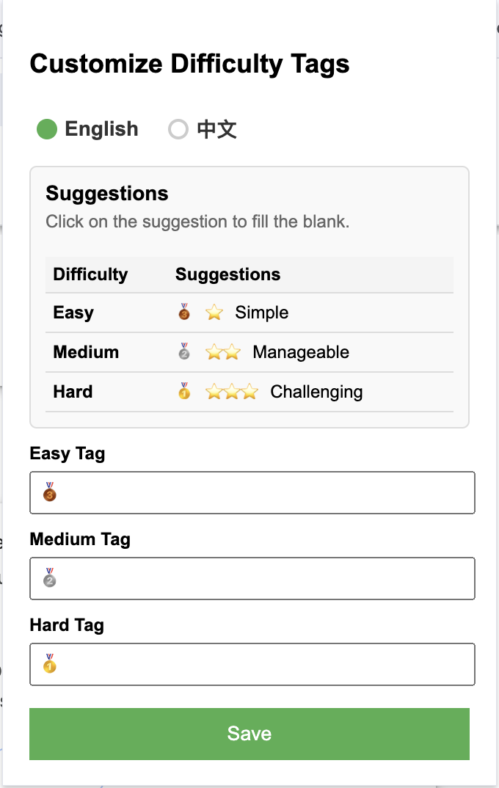
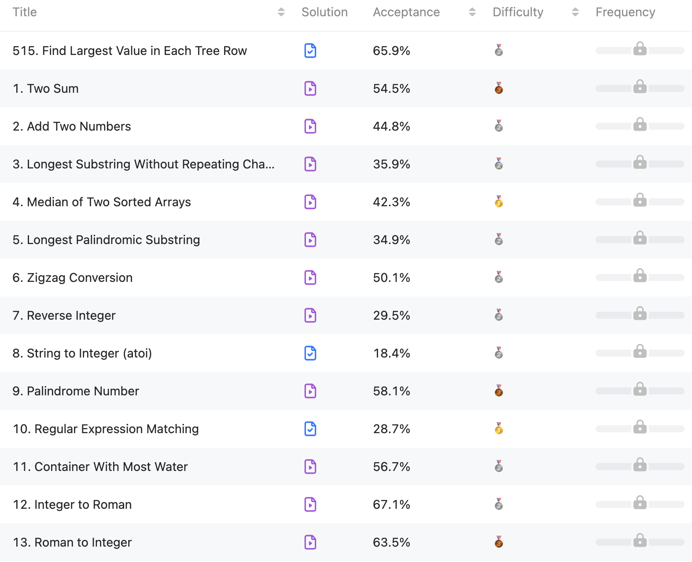
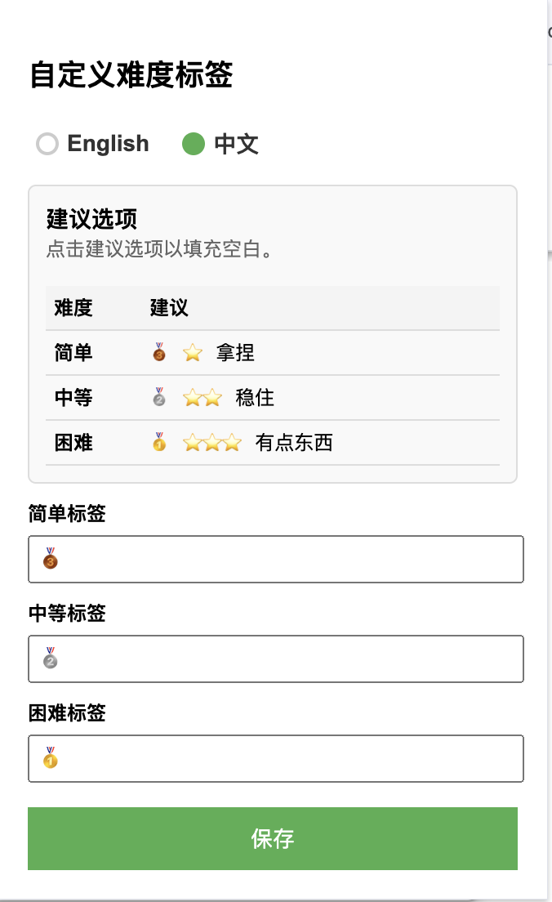
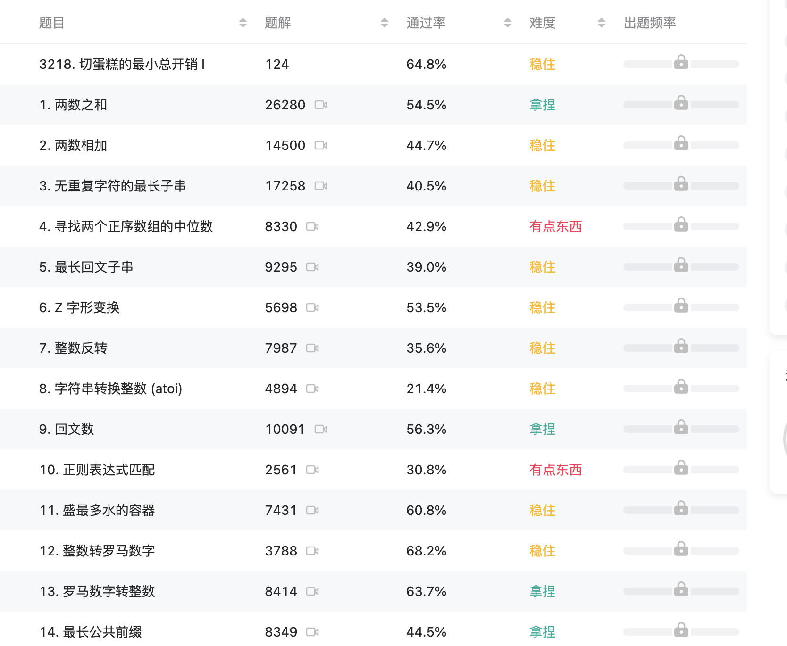

  

# LeetCode Tag Customizer

[English](#leetcode-tag-customizer) | [中文](#leetcode-标签自定义工具)

## Description

Have you ever found that the "Hard" tags on LeetCode problems feel a little bit scary, like a monster lurking in the shadows? [Scientific research](https://doi.org/10.1016/S0005-7894(72)80079-0) shows that language has a significant impact on our psychological suggestions, which in turn directly influence our behavior. Positive language can effectively motivate us to embrace challenges, while negative descriptions may lead to hesitation and avoidance.

LeetCode Tag Customizer is a Chrome extension designed to make coding practice less intimidating and more enjoyable. This tool allows users to customize the difficulty tags (“Easy,” “Medium,” “Hard”) on the LeetCode website, replacing them with custom names or even fun game-inspired icons to reduce stress and create a positive learning environment.

## Features

- Tag Customization: Change “Easy,” “Medium,” and “Hard” tags to any names you prefer (e.g., “Warm-Up,” “Challenge,” “Epic Quest”, or use emojis or text to add a playful touch to the difficulty tags.).
- Persistent Changes: Your customizations are saved across sessions.
- Simple UI: A user-friendly popup panel for easy customization.

## Installation

There are two ways to install this extension, the easiest way is to download  from the [Chrome Web Store](https://chromewebstore.google.com/?hl=en-US&utm_source=ext_sidebar), and search "**LeetCode Tag Customizer**".

You can also download the source code from Github:

 1. Clone or download this [repository](https://github.com/janice143/leetCode-tag-customizer).
 2. Open Chrome and navigate to chrome://extensions/.
 3. Enable Developer mode (toggle in the top-right corner).
 4. Click Load unpacked and select the folder containing this extension.

## Usage

 1. Open the LeetCode website.
 2. Click the extension icon in the Chrome toolbar.
 3. Use the popup to customize the tag names for “Easy,” “Medium,” and “Hard.”
 4. Refresh the LeetCode page to see your custom tags.

## Screenshots

**Popup Panel for Customization** 👇

  

**Customized LeetCode Tags** 👇

  

## Contributions Welcome! 🚀✨

Contributions are welcome! Feel free to open an issue or submit a pull request for bug fixes, new features, or improvements. 🤝

Got an idea or found an issue?  
👉 [Open an issue](https://github.com/janice143/leetCode-tag-customizer/issues) or [submit a pull request](https://github.com/janice143/leetCode-tag-customizer/pulls)!  

## License

This project is licensed under the MIT License.

## Changelog

For a detailed list of changes, see the [CHANGELOG.md](./CHANGELOG.md)
---

# LeetCode 标签自定义工具

## 描述

你是否曾因为看到 LeetCode 上的“困难”标签而心生畏惧，觉得自己可能无法完成？[科学研究表明](https://kns.cnki.net/kcms2/article/abstract?v=ZZIl2iqmIcSJoFQSMH9fDPMMddFXGjJ2MF6fvawJoLxQem-QVDFY9wdj8_0X2l26cDfwgR_Fbebq1bW3HbLs5l2ABrBPpNdbScIWK3afFx2fZ7SkspbZ-qFUidccC_G1og5OLy658iOqKeyYmq45aOUmrsljqg6xMCQmdSwlbV5QhOGdOM9VjOJl30Q6-R3g&uniplatform=NZKPT&language=CHS))，语言对我们的心理暗示有显著影响，进而直接影响行为表现。积极的语言描述可以有效激励人们迎接挑战，而消极的语言可能导致退缩。

本项目是一个 Chrome 扩展程序，可以帮助你自定义 LeetCode 上的难度标签。例如，将“简单”改为“轻松拿捏”，“中等”改为“稳步推进”，“困难”改为“挑战自我”。通过正向激励的文字描述，这款工具可以为你营造一个积极的刷题氛围，让你的练习更加高效、愉快、充满动力！

## 功能

- **标签自定义**：将“简单”、“中等”和“困难”替换成你喜欢的名称（例如“拿捏”、“稳住”、“有点东西”），或者使用表情符号或文字为难度标签增添趣味。
- **持久保存**：你的自定义设置会在每次会话中自动保存。
- **简介的用户界面**：提供了一个友好的交互界面，方便快捷地进行自定义。

## 安装

有两种方式可以安装这个扩展程序，最简单的方法是<u>从 Chrome 网上应用店 下载并搜索 “LeetCode Tag Customizer”</u>。

您也可以从 GitHub 下载源代码：

 1. 克隆或下载这个 [GitHub 仓库](https://github.com/janice143/leetCode-tag-customizer)。
 2. 打开 Chrome 并导航到 chrome://extensions/。
 3. 启用 开发者模式（右上角切换开关）。
 4. 点击 加载已解压的扩展程序，然后选择包含此扩展的文件夹。

## 使用方法

 1. 打开 LeetCode 网站。
 2. 点击 Chrome 工具栏中的扩展程序图标。
 3. 在弹出窗口中自定义“简单”、“中等”和“困难”标签的名称。
 4. 刷新 LeetCode 页面即可看到您的自定义标签。

## 截图

**标签自定义弹出窗口** 👇

  

**自定义后的 LeetCode 标签** 👇

  

欢迎贡献！🚀✨

欢迎社区贡献！无论是修复bug、提出新功能还是改进代码，你的帮助对项目非常重要。🤝

有想法或发现了问题？

👉 [提交问题](https://github.com/janice143/leetCode-tag-customizer/issues) or [提交拉取请求](https://github.com/janice143/leetCode-tag-customizer/pulls)!  

## 许可证

本项目采用 MIT 许可证。

## 变更日志

想看项目的变更，点击 [CHANGELOG.md](./CHANGELOG.md)。
